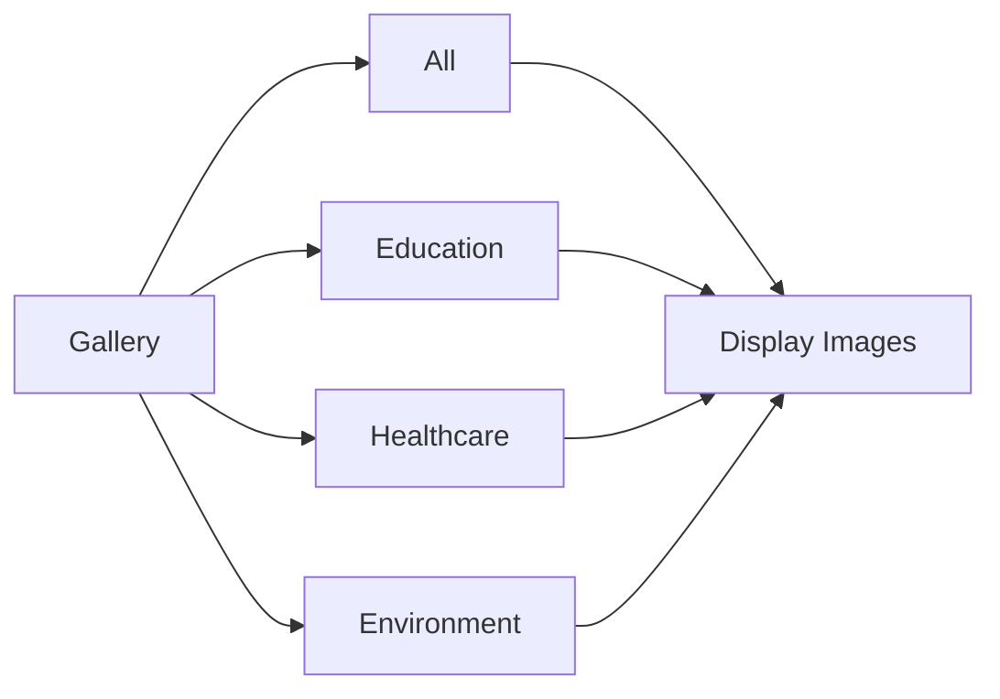
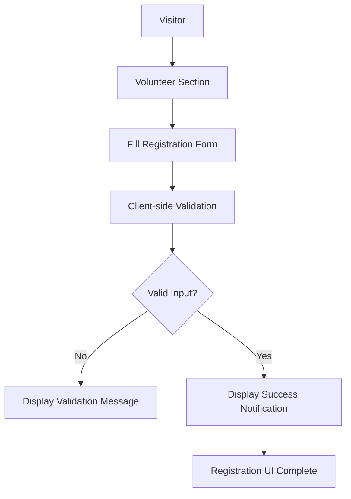
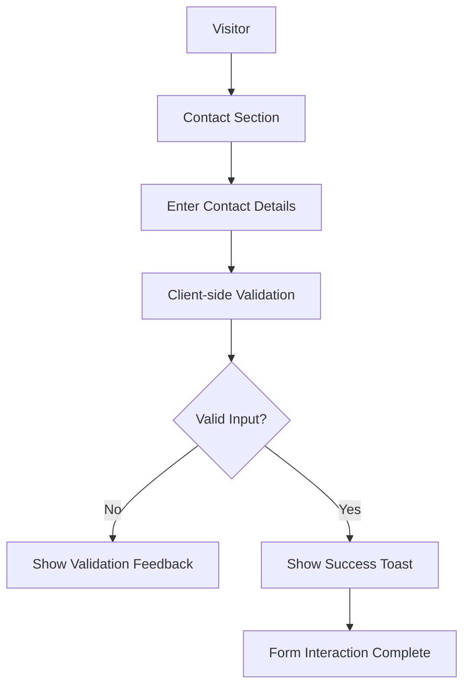
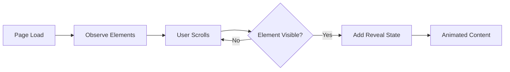
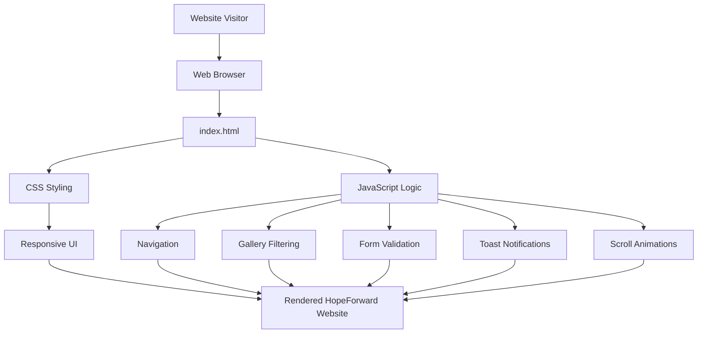
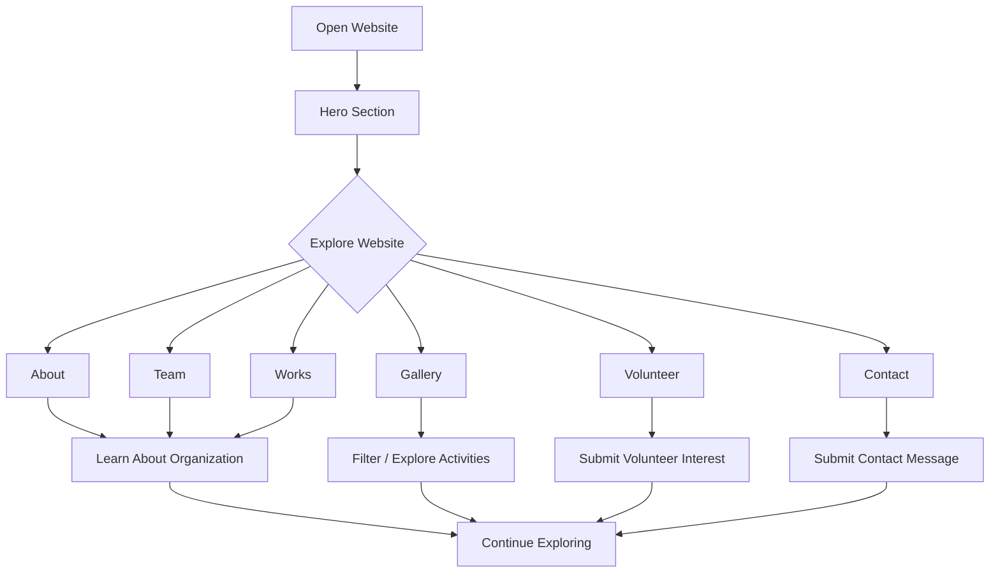
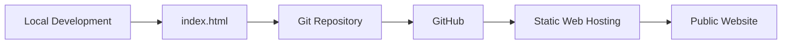
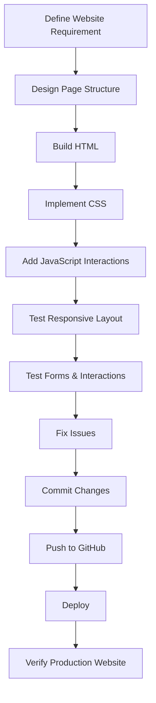

# 🌱 HopeForward NGO Website

### Responsive Non-Profit Organization Website

HopeForward is a responsive single-page NGO website designed to present an organization's mission, values, team, projects, gallery, volunteer opportunities, and contact information through a modern and accessible web interface.

The project focuses on creating a clean digital presence for a non-profit organization while providing visitors with clear ways to learn about the organization and express interest in volunteering or contacting the team.

---

## 🌐 Live Demo

Add the deployed website URL here when the project is hosted.

```text
https://your-live-demo-url.com/
```

---

# 📌 Overview

A non-profit organization needs a clear online presence to communicate its mission, showcase its work, connect with volunteers, and provide visitors with an easy way to get in touch.

**HopeForward** provides a complete single-page website experience containing:

- Organization introduction
- Mission, vision, and values
- Team information
- Project / work showcase
- Image gallery
- Gallery category filtering
- Volunteer registration interface
- Contact form
- Responsive navigation
- Mobile navigation menu
- Scroll-based animations
- Toast notifications

The project is implemented as a lightweight frontend application using **HTML5, CSS3, and Vanilla JavaScript**.

---

# 🎯 Problem Statement

Many small non-profit organizations need a professional web presence but may not have access to a complex web platform or backend infrastructure.

A useful NGO website should make it easy for visitors to:

- Understand the organization's purpose
- Learn about its mission and values
- Discover its projects
- View its activities
- Learn about the team
- Explore volunteer opportunities
- Contact the organization

HopeForward addresses these requirements through a structured and responsive single-page website.

---

# 💡 Solution

The website organizes important NGO information into clearly separated sections.

```text
                         VISITOR
                            │
                            ▼
                    ┌───────────────┐
                    │  HopeForward  │
                    │    Website    │
                    └───────┬───────┘
                            │
       ┌────────────────────┼────────────────────┐
       │                    │                    │
       ▼                    ▼                    ▼
   About / Mission       Our Team             Our Works
       │                    │                    │
       ▼                    ▼                    ▼
   Organization          Team Info          Project Showcase
       │                    │                    │
       └────────────────────┼────────────────────┘
                            │
       ┌────────────────────┼────────────────────┐
       │                    │                    │
       ▼                    ▼                    ▼
    Gallery             Volunteer            Contact
       │                    │                    │
       ▼                    ▼                    ▼
   Filter / View       Registration UI       Contact UI
```

---

# ✨ Key Features

## 🏠 Hero Section

The hero section introduces the organization and communicates its primary purpose.

It provides:

- Main headline
- Supporting description
- Primary call-to-action
- Secondary action
- Visual introduction to the organization

---

## 📖 About Section

The About section provides visitors with information about the organization.

It includes:

- Organization introduction
- Mission
- Vision
- Core values

This helps visitors understand what the organization represents.

---

## 🎯 Mission, Vision & Values

The website presents the organization's principles in a structured format.

```text
                 HOPEFORWARD
                      │
          ┌───────────┼───────────┐
          │           │           │
          ▼           ▼           ▼
       Mission      Vision      Values
          │           │           │
          ▼           ▼           ▼
       Purpose      Future     Principles
```

---

# 👥 Team Section

The Team section introduces members of the organization.

It is designed to provide visitors with a human connection to the NGO and improve transparency around the people involved in its work.

---

# 🚀 Works / Projects Section

The Works section showcases projects and activities undertaken by the organization.

Project information can communicate:

- Project title
- Project description
- Project category
- Project imagery
- Community impact

This section helps visitors understand the organization's practical work.

---

# 🖼️ Gallery

The Gallery section provides a visual representation of the organization's activities.

### Gallery Features

- Image-based project/activity showcase
- Category filtering
- Responsive gallery layout
- Interactive filtering

### Gallery Flow



---

# 🤝 Volunteer Registration

The website includes a volunteer registration interface.

Visitors can provide information through the volunteer form.

Typical fields include:

- Full name
- Email
- Phone
- Area of interest
- Message / additional information

### Volunteer Flow



> **Important:** The current frontend implementation validates the form and displays a success notification. It does not currently persist volunteer submissions to a backend database or send them to an external service.

---

# 📩 Contact Form

The website also provides a contact interface for visitors who want to communicate with the organization.

### Contact Flow



> The current contact form is a frontend interaction. A production backend, email service, or database integration is not currently claimed.

---

# 🧭 Website Navigation

```text
HopeForward
│
├── Home
├── About
├── Team
├── Works
├── Gallery
├── Volunteer
└── Contact
```

The navigation also includes a responsive mobile menu for smaller screens.

---

# 📱 Responsive Design

The website is designed to work across different screen sizes.

### Supported Layouts

- Desktop
- Tablet
- Mobile

Responsive behavior includes:

- Mobile navigation menu
- Flexible layouts
- Responsive cards
- Responsive gallery
- Adaptive typography
- Mobile-friendly forms
- Flexible section spacing

---

# 📐 Responsive Layout Concept

```text
              ┌─────────────────────────┐
              │        Desktop          │
              │  Multi-column Layout    │
              └────────────┬────────────┘
                           │
                    Responsive CSS
                           │
              ┌────────────▼────────────┐
              │         Tablet          │
              │  Adaptive Grid Layout   │
              └────────────┬────────────┘
                           │
                    Responsive CSS
                           │
              ┌────────────▼────────────┐
              │          Mobile         │
              │  Single-column Layout   │
              └─────────────────────────┘
```

---

# ✨ Interactive Features

The project uses Vanilla JavaScript to provide client-side interactions.

### Implemented interactions include:

- Mobile navigation toggle
- Gallery filtering
- Form validation
- Toast notifications
- Scroll-based animations
- Intersection Observer-based reveal effects
- Dynamic UI behavior

---

# 🎬 Scroll Animation Workflow

The website uses the browser's **Intersection Observer API** to trigger reveal animations when elements enter the viewport.



---

# 🏗️ System Architecture

HopeForward is currently a client-side web application.



---

# 🔄 Complete User Workflow



---

# 🧩 Website Architecture

```text
┌─────────────────────────────────────────────────────────┐
│                    HOPEFORWARD                           │
├─────────────────────────────────────────────────────────┤
│                                                         │
│  NAVIGATION                                             │
│      │                                                  │
│      ├── Home                                           │
│      ├── About                                          │
│      ├── Team                                           │
│      ├── Works                                          │
│      ├── Gallery                                        │
│      ├── Volunteer                                      │
│      └── Contact                                        │
│                                                         │
├─────────────────────────────────────────────────────────┤
│                    CONTENT                              │
│                                                         │
│  Hero → About → Mission/Vision → Team → Works           │
│                         ↓                               │
│                   Gallery → Volunteer → Contact          │
│                                                         │
├─────────────────────────────────────────────────────────┤
│                    INTERACTIONS                          │
│                                                         │
│  Mobile Menu | Gallery Filter | Forms | Toasts          │
│  Scroll Animations | Responsive UI                       │
│                                                         │
└─────────────────────────────────────────────────────────┘
```

---

# 🗂️ Project Structure

The current repository is intentionally lightweight, with the main website contained in a single HTML file.

```text
NGO-Website/
│
├── index.html
│
└── README.md
```

### File Responsibilities

| File | Purpose |
|---|---|
| `index.html` | Main website containing HTML structure, CSS styling, and JavaScript interactions |
| `README.md` | Project documentation |

---

# 🛠️ Technology Stack

## Frontend

- HTML5
- CSS3
- Vanilla JavaScript

## Browser APIs / Web Features

- Intersection Observer API
- Responsive CSS
- CSS animations and transitions
- Form validation
- DOM manipulation

## External Resources

- Google Fonts

---

# 🎨 Design Approach

The interface focuses on:

- Clear visual hierarchy
- Strong call-to-action sections
- Responsive layouts
- Consistent typography
- Card-based content presentation
- Image-driven storytelling
- Accessible navigation patterns
- Smooth visual transitions

---

# 🔐 Form Handling

The current project uses client-side form validation.

```text
User Input
    │
    ▼
Form Validation
    │
    ├── Invalid → Validation Feedback
    │
    └── Valid
          │
          ▼
     Success Toast
```

### Current Limitation

The forms do **not** currently provide:

- Database storage
- Email delivery
- Server-side processing
- Persistent volunteer records
- Persistent contact messages

These can be added in future versions.

---

# 🚀 Deployment

The website is structured as a static frontend and can be deployed using platforms that support static web applications.

### Deployment Flow



### Live Demo

Add the production URL here after deployment:

```text
https://your-live-demo-url.com/
```

---

# 💻 Running Locally

## 1. Clone the repository

```bash
git clone https://github.com/Sreehitha24/NGO-Website.git
```

## 2. Navigate to the project

```bash
cd NGO-Website
```

## 3. Open the website

Since the project is a standalone HTML application, you can open:

```text
index.html
```

directly in a browser.

For a better development experience, use a local server such as VS Code Live Server.

---

# 🧭 Development Workflow



---

# 🧪 Testing Checklist

### Navigation

- [ ] Desktop navigation works
- [ ] Mobile menu opens
- [ ] Mobile menu closes
- [ ] Navigation links reach correct sections

### Content

- [ ] Hero section loads correctly
- [ ] About section displays correctly
- [ ] Team cards render correctly
- [ ] Works / projects display correctly
- [ ] Gallery images load correctly

### Gallery

- [ ] All filter works
- [ ] Education filter works
- [ ] Healthcare filter works
- [ ] Environment filter works

### Forms

- [ ] Volunteer form validates required fields
- [ ] Contact form validates required fields
- [ ] Success toast appears
- [ ] Invalid input is handled correctly

### Responsive Design

- [ ] Desktop layout
- [ ] Tablet layout
- [ ] Mobile layout
- [ ] Mobile navigation
- [ ] Responsive forms
- [ ] Responsive gallery

### Animations

- [ ] Scroll reveal animations
- [ ] Navigation interactions
- [ ] Hover effects
- [ ] Toast notifications

---

# 📸 Screenshots

Add screenshots to a `docs/screenshots/` folder if desired.

## 🏠 Home / Hero

```text
docs/screenshots/home.png
```

## 📖 About

```text
docs/screenshots/about.png
```

## 👥 Team

```text
docs/screenshots/team.png
```

## 🚀 Works / Projects

```text
docs/screenshots/works.png
```

## 🖼️ Gallery

```text
docs/screenshots/gallery.png
```

## 🤝 Volunteer

```text
docs/screenshots/volunteer.png
```

## 📩 Contact

```text
docs/screenshots/contact.png
```

---

# 📊 Feature Flow Summary

```text
                 ┌───────────────┐
                 │     HOME      │
                 └───────┬───────┘
                         │
       ┌─────────────────┼─────────────────┐
       │                 │                 │
       ▼                 ▼                 ▼
     ABOUT             TEAM             WORKS
       │                 │                 │
       └─────────────────┼─────────────────┘
                         │
                         ▼
                      GALLERY
                         │
                         ▼
                    VOLUNTEER
                         │
                         ▼
                      CONTACT
```

---

# 🔮 Future Enhancements

Potential improvements for future versions include:

## Backend Integration

```text
                    Frontend
                       │
                       ▼
                   REST API
                       │
          ┌────────────┼────────────┐
          │            │            │
          ▼            ▼            ▼
     Volunteer      Contact      Newsletter
      Service       Service        Service
          │            │            │
          └────────────┼────────────┘
                       ▼
                    Database
```

## Additional Features

- Volunteer account management
- Admin dashboard
- Volunteer application storage
- Contact-message management
- Email notifications
- Newsletter subscription
- Donation integration
- CMS-based content management
- Project management dashboard
- Gallery administration
- Analytics dashboard
- Authentication and authorization

> These are proposed future enhancements and are not part of the current frontend-only implementation.

---

# 🌱 Project Impact

The website demonstrates how a lightweight frontend application can provide a non-profit organization with a structured digital presence.

It focuses on:

- Communicating social impact
- Presenting organizational information
- Showcasing projects
- Encouraging volunteer participation
- Providing contact access
- Improving online presentation

---

# 📚 Learning Outcomes

This project provides practical exposure to:

- Semantic HTML
- Modern CSS
- Responsive web design
- Vanilla JavaScript
- DOM manipulation
- Form validation
- Client-side interactions
- Intersection Observer API
- CSS animations
- Mobile-first interface considerations
- Git and GitHub
- Static web deployment

---

# 🏆 Project Highlights

### 🌱 Purpose-Driven Website

Built around the communication needs of a non-profit organization.

### 📱 Responsive Interface

Designed to adapt across desktop, tablet, and mobile screen sizes.

### 🖼️ Visual Storytelling

Uses projects, team information, and gallery content to communicate organizational activities.

### 🤝 Volunteer Engagement

Provides a dedicated volunteer registration interface.

### 📩 Contact Experience

Includes a dedicated contact form for visitor interaction.

### ⚡ Lightweight Frontend

Built without a backend framework, making the current project simple to run and deploy.

### ✨ Interactive Experience

Includes navigation, filtering, validation, notifications, and scroll animations.

---

# 🔗 Project Links

| Resource | Link |
|---|---|
| 🌐 Live Demo | Add deployment URL |
| 💻 GitHub | https://github.com/Sreehitha24/NGO-Website |
| 👩‍💻 GitHub Profile | https://github.com/Sreehitha24 |
| 🔗 LinkedIn | https://www.linkedin.com/in/keerthipati-sreehitha/ |

---

# 👩‍💻 Author

## Keerthipati Sreehitha

Computer Science & Data Science Student  
KKR & KSR Institute of Technology and Sciences

### Interests

- Software Development
- Web Development
- Artificial Intelligence
- Cloud Computing
- Problem Solving

---

## 🌐 Connect

[](https://github.com/Sreehitha24)

[](https://www.linkedin.com/in/keerthipati-sreehitha/)

---

# ⭐ Project Summary

**HopeForward** is a responsive NGO website built with HTML5, CSS3, and Vanilla JavaScript. It provides sections for organizational information, mission and values, team members, projects, gallery content, volunteer registration, and contact interaction.

The project demonstrates practical frontend development, responsive design, client-side JavaScript interactions, form validation, visual presentation, and static website deployment.

---

⭐ Explore the repository to see the complete implementation.
